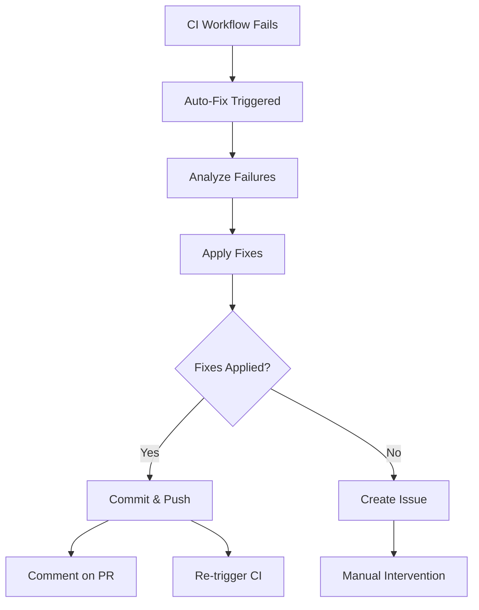

# Workflow Monitoring & Auto-Fix System

This document describes the comprehensive workflow monitoring and automatic fixing system that makes GitHub workflow results easily accessible and actionable for Cursor AI development.

## 🎯 Overview

The workflow monitoring system provides:

- **Real-time workflow status** checking
- **Automatic failure analysis** with specific suggestions
- **Auto-fix capabilities** for common issues
- **Seamless integration** with Cursor AI workflows
- **Automated PR comments** with fix reports
- **Issue creation** for complex failures

## 🚀 Quick Start

### Check Current Status
```bash
# Quick status overview
make workflow-status

# Detailed analysis with suggestions
make check-workflows

# JSON output for programmatic use
make check-workflows-json
```

### Auto-Fix Failures
```bash
# Fix issues locally (dry run first)
python scripts/auto_fix_workflow.py --dry-run

# Apply fixes and commit
make auto-fix

# Apply fixes, commit, and push
make auto-fix-push
```

## 🔧 Components

### 1. Workflow Status Checker (`scripts/check_workflows.py`)

**Features:**
- Fetches workflow runs via GitHub CLI
- Analyzes failure patterns
- Provides specific fix suggestions
- Supports both human and JSON output

**Usage:**
```bash
# Basic status check
python scripts/check_workflows.py

# Check specific branch
python scripts/check_workflows.py --branch feature/my-branch

# Get suggestions for fixes
python scripts/check_workflows.py --suggest-fixes

# JSON output for automation
python scripts/check_workflows.py --json --suggest-fixes
```

**Example Output:**
```
❌ Workflow failed for branch: feature/my-branch
🔗 URL: https://github.com/owner/repo/actions/runs/123456

Failed steps:
  - test: Lint with flake8
  - test: Format check with black

Suggested fixes:
  - Run `make format` to fix linting issues
  - Run `black src tests` to fix formatting
  - Commit the formatting changes
```

### 2. Auto-Fix Script (`scripts/auto_fix_workflow.py`)

**Capabilities:**
- **Code formatting** (Black, isort)
- **Import optimization** (autoflake)
- **Basic linting fixes**
- **Test structure issues**
- **Automatic commits**

**Usage:**
```bash
# Dry run to see what would be fixed
python scripts/auto_fix_workflow.py --dry-run

# Fix issues for current branch
python scripts/auto_fix_workflow.py --commit

# Fix and push automatically
python scripts/auto_fix_workflow.py --commit --push

# Fix specific branch
python scripts/auto_fix_workflow.py --branch feature/my-branch --commit
```

### 3. GitHub Actions Auto-Fix Workflow

**Triggers:**
- When CI workflow fails
- Manual trigger via workflow dispatch
- Scheduled maintenance runs

**Process:**
1. **Detect failure** in CI workflow
2. **Checkout failing branch**
3. **Run auto-fix script**
4. **Commit and push fixes**
5. **Comment on PR** with fix report
6. **Re-trigger failed workflow**
7. **Create issue** if fixes fail

**Configuration:**
```yaml
# Manually trigger auto-fix
gh workflow run auto-fix.yml --ref main \
  -f branch=feature/my-branch \
  -f push_fixes=true
```

## 📊 Monitoring Dashboard

### Makefile Commands

| Command | Description |
|---------|-------------|
| `make workflow-status` | Overview of current workflow status |
| `make check-workflows` | Detailed failure analysis with suggestions |
| `make auto-fix` | Automatically fix workflow failures locally |
| `make auto-fix-push` | Fix and push changes automatically |

### Status Indicators

- ✅ **All workflows passing**
- 🔄 **Workflow in progress**
- ❌ **Workflow failed** (with specific step details)
- ❓ **Unknown status**

## 🤖 Cursor AI Integration

### AI-Powered Development Workflow

1. **Create feature branch**: `make branch-from-issue`
2. **Develop with TDD**: `make test-watch`
3. **Monitor workflow status**: `make workflow-status`
4. **Auto-fix failures**: `make auto-fix`
5. **Create PR**: `make pr`

### Cursor Prompts for Workflow Issues

**For analyzing failures:**
```
"Analyze this workflow failure and suggest specific fixes:
[paste workflow output or error]"
```

**For implementing fixes:**
```
"Fix these linting/formatting issues while maintaining code quality:
[paste specific error messages]"
```

**For architecture improvements:**
```
"Refactor this code to prevent these CI failures:
[describe recurring issues]"
```

## 🔄 Automated Workflows

### 1. Auto-Fix on Failure



### 2. PR Comment Generation

When fixes are applied, the system automatically:
- **Comments on the PR** with fix details
- **Lists specific changes** made
- **Provides status update**
- **Suggests next steps**

Example PR comment:
```markdown
## 🤖 Auto-Fix Applied

I detected workflow failures and applied automatic fixes to this branch.

### Changes Made:
- ✅ Automatic formatting fixes applied
- ✅ Import sorting corrected
- ✅ Basic linting issues resolved

The workflow should now pass. If there are still issues, they may require manual intervention.
```

### 3. Issue Creation for Complex Failures

For failures that can't be auto-fixed:
- **Creates detailed issue** with failure analysis
- **Tags with appropriate labels**
- **Provides suggested manual fixes**
- **Links to workflow logs**

## 🛠️ Configuration

### Environment Setup

Required tools:
- **GitHub CLI** (`gh`) for API access
- **Python 3.11+** with development dependencies
- **Git** with proper authentication

### GitHub Permissions

The auto-fix workflow requires:
- **Contents: write** (for commits)
- **Pull requests: write** (for comments)
- **Issues: write** (for creating issues)
- **Actions: write** (for re-triggering workflows)

### Customization

**Add custom fix patterns** in `auto_fix_workflow.py`:
```python
def fix_custom_issue(self) -> bool:
    """Fix your specific issue pattern."""
    # Implementation here
    pass
```

**Extend failure analysis** in `check_workflows.py`:
```python
def suggest_fixes(self, analysis: Dict[str, Any]) -> List[str]:
    # Add custom suggestion logic
    pass
```

## 📈 Best Practices

### 1. Preventive Measures
- **Run `make ci`** before committing
- **Use pre-commit hooks** for early detection
- **Regular dependency updates**
- **Monitor workflow trends**

### 2. Reactive Measures
- **Quick auto-fix** for formatting/linting
- **Manual review** of auto-generated fixes
- **Root cause analysis** for recurring issues
- **Documentation updates** based on patterns

### 3. Team Workflow
- **Shared responsibility** for workflow health
- **Regular review** of auto-fix effectiveness
- **Continuous improvement** of fix patterns
- **Knowledge sharing** about common issues

## 🚨 Troubleshooting

### Common Issues

**Auto-fix script fails to run:**
```bash
# Check GitHub CLI authentication
gh auth status

# Verify repository access
gh repo view

# Check Python dependencies
pip list | grep -E "(requests|subprocess)"
```

**Workflow permissions denied:**
```bash
# Check repository permissions
gh repo view --json permissions

# Verify GITHUB_TOKEN scope
# (Should have repo, workflow, and actions permissions)
```

**False positive failures:**
```bash
# Review workflow logs
gh run view <run-id> --log

# Check for network/infrastructure issues
# Consider retry logic in workflows
```

### Recovery Procedures

**If auto-fix creates bad commits:**
```bash
# Reset to previous state
git reset --hard HEAD~1

# Apply manual fixes
make ci  # Verify locally first

# Commit properly
git commit -m "fix: manual workflow fixes"
```

**If workflow is stuck in failure loop:**
```bash
# Disable auto-fix temporarily
# Edit .github/workflows/auto-fix.yml
# Add condition: if: false

# Fix root cause manually
# Re-enable auto-fix
```

### GitHub CLI Pager Problems

**Issue**: GitHub CLI commands fail with errors like:
```
head: |: No such file or directory
head: cat: No such file or directory
```

**Root Cause**: Misconfigured pager settings interfere with GitHub CLI output processing.

**Solution**: The monitoring system includes a `RobustGitHubCLI` wrapper that:
- Sets `GH_PAGER=""` to disable paging
- Configures proper environment variables
- Provides API fallbacks when CLI fails
- Handles authentication and parsing issues

**Manual Fix**:
```bash
export GH_PAGER=""
export PAGER=""
export NO_COLOR="1"
```

### Robust Monitoring Features

The system includes multiple layers of reliability:

1. **Environment Setup**: Automatically configures GitHub CLI environment
2. **API Fallbacks**: Falls back to direct GitHub API when CLI fails
3. **Error Handling**: Graceful degradation with informative error messages
4. **Timeout Protection**: Prevents hanging on network issues
5. **Authentication Validation**: Checks and validates GitHub authentication

**Testing the Robust System**:
```bash
# Test the robust GitHub CLI wrapper
python scripts/robust_github_cli.py

# Use enhanced workflow checking
make check-workflows
```

## 📊 Metrics & Analytics

### Trackable Metrics
- **Auto-fix success rate**
- **Time to resolution**
- **Most common failure patterns**
- **Manual intervention frequency**

### Improvement Opportunities
- **Pattern recognition** for new auto-fixes
- **Workflow optimization** based on failure data
- **Documentation updates** for common issues
- **Tool configuration** improvements

This monitoring system transforms GitHub workflow failures from roadblocks into automatically resolved stepping stones, keeping your Cursor AI development flow smooth and productive.
